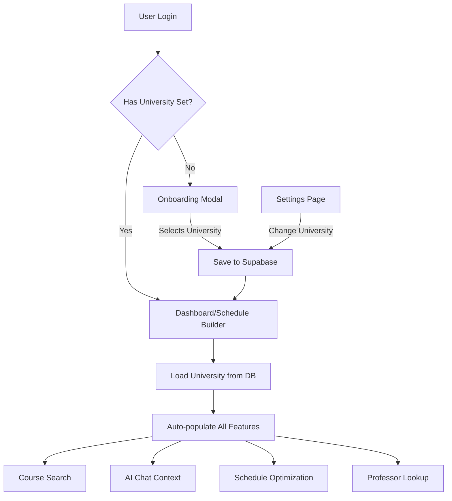
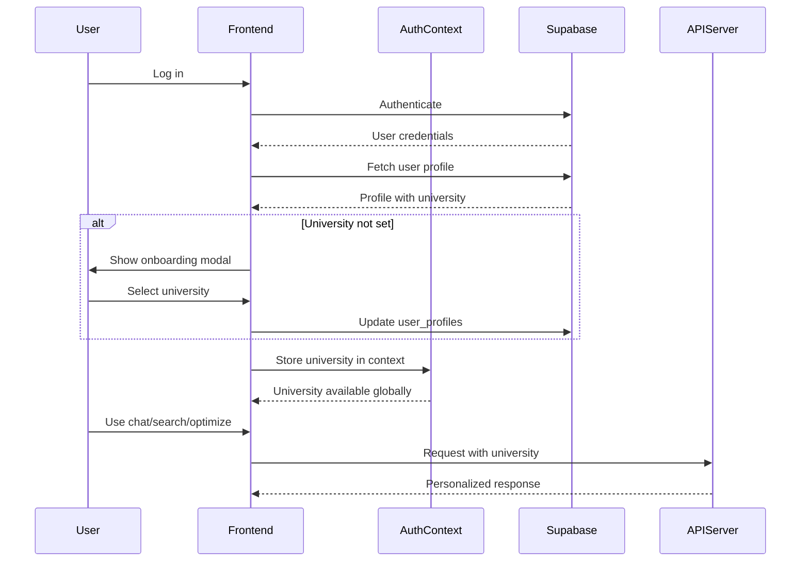

# College Selection Feature - Design Document

## Design Philosophy

### Core Principles

1. **User-Centric Experience**: The college selection should feel natural and non-intrusive, integrated seamlessly into the user's onboarding and normal workflow.

2. **Data Persistence**: User preferences should be stored reliably in the database, ensuring consistency across sessions, devices, and all application features.

3. **Flexibility**: Users should be able to change their college selection at any time without friction.

4. **Single Source of Truth**: The user's selected college should be the authoritative source for all features (AI chat, course search, schedule optimization, professor lookup).

5. **Progressive Enhancement**: Start with a working dropdown (already implemented) and enhance it with database persistence without breaking existing functionality.

## Architecture Overview

### System Architecture



### Data Flow



## Component Architecture

### 1. Database Layer (Supabase)

**Table: `user_profiles`**

```sql
- id (uuid, primary key, references auth.users)
- university (text, not null)
- created_at (timestamp)
- updated_at (timestamp)
```

**Features:**

- Row-level security (RLS) policies for user data protection
- Automatic timestamp updates
- Foreign key relationship to auth.users

### 2. Backend Layer (Python API)

**Changes Required:**

- Accept `university` from user context (already done)
- Optionally validate university names
- No significant changes needed (already accepts university parameter)

### 3. Frontend Layer (React)

#### 3.1 Auth Context Enhancement

- Add `university` to user context
- Provide `updateUniversity()` function
- Auto-load university on login

#### 3.2 Onboarding Modal Component

- Shows only on first login (when university is null)
- Clean, welcoming UI
- Dropdown with all CUNY schools
- Non-dismissible until university is selected

#### 3.3 Settings Page Component

- Allows changing university
- Shows current university
- Confirmation dialog for changes

#### 3.4 Schedule Builder Updates

- Remove local `selectedUniversity` state
- Use university from auth context
- Dropdown becomes read-only or hidden (optional)

## UI/UX Design

### Onboarding Modal Design

**Visual Hierarchy:**

1. Welcome message with branding
2. Clear question: "Which CUNY school do you attend?"
3. Dropdown with all schools
4. "Get Started" button (disabled until selection)
5. Optional: Brief explanation of why we need this

**User Flow:**

```
Login → Check DB → No University? → Modal appears
                ↓
            Has University? → Proceed to app
```

### Settings Page Design

**Layout:**

```
My Profile
├── Account Settings
├── University Preference
│   └── Current: [Hunter College] [Change]
└── Notification Preferences
```

## State Management Strategy

### Global State (Auth Context)

```typescript
interface UserProfile {
  id: string;
  email: string;
  university: string | null;
  created_at: string;
}

interface AuthContextType {
  user: User | null;
  profile: UserProfile | null;
  updateUniversity: (university: string) => Promise<void>;
}
```

### Local State

- Onboarding modal: Open/closed state
- Settings page: Edit mode, loading states

## Data Validation

### Frontend Validation

- University must be selected from dropdown (no free text)
- Cannot be empty string

### Backend Validation

- Validate against allowed CUNY schools list
- Return 400 error for invalid universities

### Allowed Universities

```typescript
const CUNY_SCHOOLS = [
  "Baruch College",
  "Brooklyn College",
  "City College",
  "Hunter College",
  "Queens College",
  "College of Staten Island",
  "John Jay College",
  "Lehman College",
  "Medgar Evers College",
  "New York City College of Technology",
  "York College",
  "Queensborough Community College",
  "Borough of Manhattan Community College (BMCC)",
  "Bronx Community College",
  "Hostos Community College",
  "LaGuardia Community College",
];
```

## Security Considerations

### Row-Level Security (RLS)

- Users can only read/update their own profile
- Prevent unauthorized access to other users' data

### Data Privacy

- University is not sensitive data, but still protected
- Logged in audit trail for changes

## Migration Strategy

### Phase 1: Database Setup

1. Create `user_profiles` table
2. Set up RLS policies
3. Create migration script for existing users

### Phase 2: Backend Integration

- No changes needed (already accepts university)

### Phase 3: Frontend Implementation

1. Update auth context
2. Create onboarding modal
3. Add settings page
4. Update existing components to use context

### Phase 4: Testing & Rollout

1. Test onboarding flow
2. Test university changes
3. Verify all features use correct university
4. Deploy to production

## Fallback & Error Handling

### Scenarios to Handle

1. **Database unavailable**: Use local storage fallback, sync when available
2. **User profile fetch fails**: Show error, allow retry
3. **Update fails**: Show error message, don't clear selection
4. **Invalid university in DB**: Show validation error, re-prompt

## Future Enhancements

### V2 Features (Post-MVP)

- Support for multiple universities (transfer students)
- University-specific features/themes
- Cross-university course search
- Analytics on university distribution

## Success Metrics

### Key Performance Indicators

- % of users who complete onboarding
- Time to complete university selection
- % of users who change university in settings
- Reduction in API errors due to missing university
- User satisfaction with personalized experience

## Technical Debt Prevention

### Clean Code Practices

- Single source of truth (auth context)
- No hardcoded university names
- Reusable university dropdown component
- Proper TypeScript types
- Comprehensive error handling
