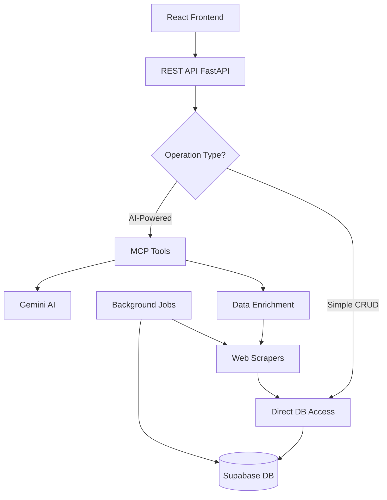

# Hybrid Implementation Design Document

## Overview

This document outlines the design for implementing a hybrid data access pattern in the CUNY Schedule Optimizer backend, combining direct database access for simple operations with intelligent MCP tool usage for complex AI-powered features.

## Problem Statement

Currently, the system has two issues:

1. **Empty Database**: No data exists because background jobs haven't populated it yet
2. **Inefficient Architecture**: LLM makes database calls that return empty results instead of using MCP tools to fetch/enrich data

## Design Goals

1. **Automatic Data Population**: System should auto-populate missing data on-demand
2. **Performance Optimization**: Use direct DB access for simple queries, MCP tools for complex operations
3. **Graceful Degradation**: Handle missing data elegantly with fallback mechanisms
4. **Cost Efficiency**: Minimize LLM API calls for operations that don't require AI reasoning
5. **User Experience**: Provide immediate value even with empty database

---

## Architecture Design

### High-Level Architecture



### Component Responsibilities

#### 1. REST API Layer (`api_server.py`)

**Responsibility**: Route requests to appropriate data access pattern

**Simple Operations** (Direct DB):

- `GET /api/courses` - List courses
- `GET /api/sections` - List sections
- `GET /api/professor/{name}` - Get professor details (if exists)
- `POST /api/courses/search` - Filter courses

**Complex Operations** (MCP Tools):

- `POST /api/schedule/optimize` - AI-powered schedule generation
- `POST /api/professor/compare` - Professor comparison with recommendations
- `POST /api/schedule/validate` - Conflict detection with suggestions
- `POST /api/chat/message` - AI assistant interactions

#### 2. MCP Tools Layer (`mcp_server/tools/`)

**Responsibility**: Intelligent operations with auto-enrichment

**Enhanced Capabilities**:

- Check DB first for existing data
- Auto-trigger scrapers if data missing or stale
- Perform AI analysis (sentiment, optimization, recommendations)
- Cache results for performance

#### 3. Service Layer (`mcp_server/services/`)

**Responsibility**: Business logic and data enrichment

**New/Enhanced Services**:

- `DataEnrichmentService` - Coordinates scraping and DB population
- `SupabaseService` - Enhanced with staleness checks
- Scrapers - On-demand execution capability

#### 4. Background Jobs (`background_jobs/`)

**Responsibility**: Proactive data maintenance

**Enhanced Jobs**:

- Run on schedule as before
- Also callable on-demand for immediate needs
- Track last sync timestamps per semester/university

---

## Data Flow Patterns

### Pattern 1: Simple Query (Direct DB)

```
User Request → REST API → Supabase → Return Data
```

**Example**: Fetching list of courses for a semester

- **Fast**: Single DB query
- **Cheap**: No LLM costs
- **Simple**: No complex logic

### Pattern 2: Complex Operation (MCP Tools)

```
User Request → REST API → MCP Tool → Gemini AI → Optimized Result
                              ↓
                         Supabase DB
```

**Example**: Generating optimized schedule

- **Intelligent**: AI-powered constraint solving
- **Comprehensive**: Considers multiple factors
- **Value-Added**: Provides rankings and recommendations

### Pattern 3: Auto-Enrichment (Hybrid)

```
User Request → MCP Tool → Check DB
                            ↓
                    Data Missing/Stale?
                            ↓
                    Trigger Scraper → Populate DB
                            ↓
                    Fetch Fresh Data → AI Processing → Return
```

**Example**: Getting professor grade when professor not in DB

- **Resilient**: Handles missing data
- **Fresh**: Gets latest information
- **Cached**: Stores for future requests

---

## Implementation Strategy

### Phase 1: Data Staleness Detection

Add staleness tracking to determine when to refresh data:

```python
class DataFreshnessService:
    """Determine if data needs refreshing"""

    COURSE_DATA_TTL = 7 * 24 * 3600  # 7 days
    PROFESSOR_DATA_TTL = 7 * 24 * 3600  # 7 days
    REVIEW_DATA_TTL = 30 * 24 * 3600  # 30 days

    async def is_course_data_fresh(semester: str, university: str) -> bool:
        """Check if course data is recent enough"""

    async def is_professor_data_fresh(professor_id: UUID) -> bool:
        """Check if professor data is recent enough"""
```

### Phase 2: On-Demand Data Population

Enable background jobs to run on-demand:

```python
class DataPopulationService:
    """Coordinate on-demand data fetching"""

    async def ensure_course_data(semester: str, university: str):
        """Ensure course data exists and is fresh"""
        if not await freshness_service.is_course_data_fresh(semester, university):
            await sync_courses_job(semester, university)

    async def ensure_professor_data(professor_name: str, university: str):
        """Ensure professor data exists and is fresh"""
        professor = await supabase_service.get_professor_by_name(...)
        if not professor or not await freshness_service.is_professor_data_fresh(...):
            await scrape_and_analyze_professor(professor_name, university)
```

### Phase 3: Enhanced MCP Tools

Update MCP tools with auto-enrichment:

```python
@mcp.tool()
async def fetch_course_sections(course_codes, semester, university):
    """Fetch sections with auto-population"""

    # Ensure data exists
    await data_population_service.ensure_course_data(semester, university)

    # Fetch from DB
    sections = await supabase_service.get_sections(...)

    return sections
```

### Phase 4: Smart REST API Endpoints

Add intelligence to API endpoints:

```python
@app.get("/api/courses")
async def get_courses(semester: str, university: str, auto_populate: bool = True):
    """Get courses with optional auto-population"""

    courses = await supabase_service.get_courses_by_semester(semester, university)

    if not courses and auto_populate:
        # Trigger population
        await data_population_service.ensure_course_data(semester, university)
        courses = await supabase_service.get_courses_by_semester(semester, university)

    return {"courses": courses, "auto_populated": not courses}
```

---

## Data Freshness Strategy

### Staleness Thresholds

| Data Type           | TTL     | Rationale                                   |
| ------------------- | ------- | ------------------------------------------- |
| Course Sections     | 7 days  | Course schedules change during registration |
| Professor Info      | 7 days  | Ratings update frequently                   |
| Reviews             | 30 days | Reviews accumulate slowly                   |
| Optimized Schedules | 1 hour  | User preferences may change                 |

### Refresh Triggers

1. **Scheduled** - Background jobs run on cron schedule
2. **On-Demand** - User request triggers refresh if stale
3. **Manual** - Admin can force refresh via API endpoint

---

## Caching Strategy

### Multi-Level Caching

```
┌─────────────────────────────────────────┐
│ Level 1: In-Memory Cache (1 hour TTL)  │
├─────────────────────────────────────────┤
│ Level 2: Database (7-30 day TTL)       │
├─────────────────────────────────────────┤
│ Level 3: Web Scraping (Fresh Data)     │
└─────────────────────────────────────────┘
```

**Cache Keys**:

- `courses:{semester}:{university}` - Course listings
- `professor:{name}:{university}` - Professor data
- `schedule:{hash(constraints)}` - Optimized schedules

---

## Error Handling

### Graceful Degradation

```python
async def get_professor_with_fallback(name: str, university: str):
    """Get professor with multiple fallback strategies"""

    try:
        # Try DB first
        professor = await supabase_service.get_professor_by_name(name, university)
        if professor:
            return professor
    except Exception as e:
        logger.warning(f"DB lookup failed: {e}")

    try:
        # Fallback: Scrape RateMyProfessors
        prof_data = await ratemyprof_scraper.scrape_professor_data(name, university)
        if prof_data:
            # Save to DB for next time
            professor = await supabase_service.insert_professor(...)
            return professor
    except Exception as e:
        logger.error(f"Scraping failed: {e}")

    # Final fallback: Return partial data
    return {
        "name": name,
        "university": university,
        "grade": "N/A",
        "note": "Data unavailable"
    }
```

---

## Performance Considerations

### Optimization Techniques

1. **Batch Operations**: Scrape multiple professors/courses in single job
2. **Async Processing**: Non-blocking scraping operations
3. **Connection Pooling**: Reuse DB connections
4. **Query Optimization**: Use indexes on frequently queried fields
5. **Lazy Loading**: Only fetch detailed data when needed

### Expected Performance

| Operation                | Current     | After Implementation  |
| ------------------------ | ----------- | --------------------- |
| List Courses (cached)    | N/A (empty) | < 100ms               |
| List Courses (fresh)     | N/A         | < 5s (with scraping)  |
| Professor Grade (cached) | N/A         | < 50ms                |
| Professor Grade (fresh)  | N/A         | < 10s (with scraping) |
| Schedule Optimization    | N/A         | < 3s                  |

---

## Security Considerations

1. **Rate Limiting**: Prevent abuse of scraping endpoints
2. **Input Validation**: Sanitize all user inputs
3. **API Keys**: Secure storage of Gemini/Supabase keys
4. **CORS**: Restrict to known frontend origins
5. **Scraping Ethics**: Respect robots.txt and rate limits

---

## Monitoring & Observability

### Metrics to Track

- **Cache Hit Rate**: Percentage of requests served from cache
- **Scraping Frequency**: How often scrapers are triggered
- **Data Freshness**: Age of data in database
- **API Response Times**: P50, P95, P99 latencies
- **Error Rates**: Failed scraping attempts, DB errors

### Logging Strategy

```python
logger.info("Data access", extra={
    "operation": "fetch_courses",
    "source": "cache|db|scraper",
    "duration_ms": 150,
    "cache_hit": True
})
```

---

## Migration Plan

### Phase 1: Foundation (Week 1)

- Implement data freshness service
- Add staleness tracking to DB models
- Create on-demand job execution

### Phase 2: Enhancement (Week 2)

- Update MCP tools with auto-enrichment
- Add fallback logic to all data access points
- Implement caching improvements

### Phase 3: API Updates (Week 3)

- Enhance REST API endpoints
- Add auto-population flags
- Implement error handling

### Phase 4: Testing & Optimization (Week 4)

- Load testing
- Performance optimization
- Documentation updates

---

## Success Criteria

✅ **Functional Requirements**:

- System works with empty database
- Auto-populates missing data on first request
- Direct DB access for simple operations
- MCP tools for complex operations

✅ **Performance Requirements**:

- < 100ms for cached queries
- < 5s for fresh data (with scraping)
- > 80% cache hit rate after warmup

✅ **User Experience**:

- No manual data seeding required
- Immediate value on first use
- Transparent data freshness

---

## Future Enhancements

1. **Redis Cache**: Replace in-memory cache with Redis for distributed caching
2. **Webhook Updates**: Real-time updates from CUNY when schedules change
3. **Predictive Prefetching**: Pre-populate data for upcoming semesters
4. **GraphQL API**: More flexible querying for frontend
5. **Real-time Sync**: WebSocket updates for live schedule changes
