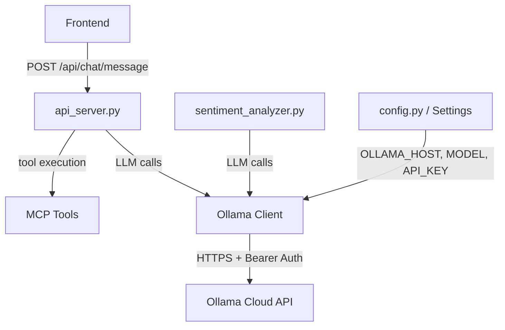
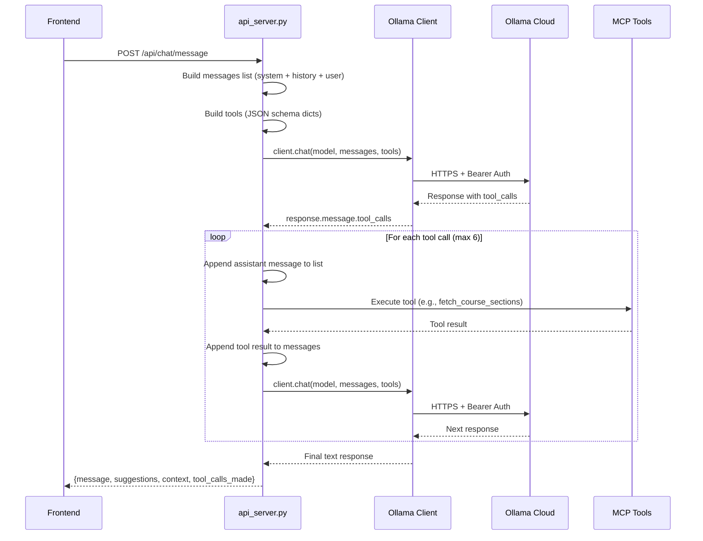

# Technical Design: Ollama LLM Migration

## Architecture Overview

The migration replaces the Google GenAI SDK with the Ollama Python library at the **LLM integration layer** only. All other layers (HTTP endpoints, MCP tools, database, frontend) remain unchanged.



## Component Breakdown

### 1. Configuration Layer (`config.py`)

**Before:**
```python
gemini_api_key: str = Field(..., alias="GEMINI_API_KEY")  # Required
```

**After:**
```python
ollama_host: str = Field(default="https://ollama.com", alias="OLLAMA_HOST")
ollama_model: str = Field(default="gemini-3-flash-preview", alias="OLLAMA_MODEL")
ollama_api_key: Optional[str] = Field(default=None, alias="OLLAMA_API_KEY")
```

### 2. Ollama Client Initialization Pattern

Shared pattern used in both `api_server.py` and `sentiment_analyzer.py`:

```python
from ollama import Client as OllamaClient

def _create_ollama_client() -> OllamaClient:
    headers = {}
    if settings.ollama_api_key:
        headers['Authorization'] = f'Bearer {settings.ollama_api_key}'
    return OllamaClient(host=settings.ollama_host, headers=headers)
```

### 3. Chat Endpoint (`api_server.py`)

#### Tool Declaration Format

**Google GenAI** (protobuf):
```python
genai.protos.FunctionDeclaration(
    name="fetch_course_sections",
    parameters=genai.protos.Schema(
        type=genai.protos.Type.OBJECT,
        properties={
            "course_codes": genai.protos.Schema(type=genai.protos.Type.ARRAY, ...)
        }
    )
)
```

**Ollama** (JSON schema):
```python
{
    'type': 'function',
    'function': {
        'name': 'fetch_course_sections',
        'description': '...',
        'parameters': {
            'type': 'object',
            'required': ['course_codes'],
            'properties': {
                'course_codes': {'type': 'array', 'items': {'type': 'string'}, 'description': '...'}
            }
        }
    }
}
```

#### Conversation Flow

**Google GenAI** (stateful chat):
```python
model = genai.GenerativeModel('gemini-2.5-flash', tools=[tools], system_instruction=...)
chat = model.start_chat(history=chat_history)
response = chat.send_message(user_message)
# Tool response:
chat.send_message([genai.protos.Part(function_response=...)])
```

**Ollama** (stateless messages list):
```python
messages = [
    {'role': 'system', 'content': system_instruction},
    *history_messages,
    {'role': 'user', 'content': user_message}
]
response = client.chat(model=settings.ollama_model, messages=messages, tools=tools)
# Tool response:
messages.append(response.message)  # assistant's tool_call message
messages.append({'role': 'tool', 'tool_name': '...', 'content': json.dumps(result)})
response = client.chat(model=settings.ollama_model, messages=messages, tools=tools)
```

#### Tool Call Detection

| Aspect | Google GenAI | Ollama |
|--------|-------------|--------|
| Check for tool calls | `part.function_call.name` | `response.message.tool_calls` |
| Get function name | `fc_part.function_call.name` | `tc.function.name` |
| Get arguments | `dict(fc.args)` | `tc.function.arguments` |
| Send tool result | `genai.protos.Part(function_response=...)` | `{'role': 'tool', 'tool_name': ..., 'content': ...}` |
| Get final text | `part.text` | `response.message.content` |

### 4. Sentiment Analyzer (`sentiment_analyzer.py`)

| Aspect | Google GenAI | Ollama |
|--------|-------------|--------|
| Init | `genai.configure(api_key=...); genai.GenerativeModel(...)` | `Client(host=..., headers=...)` |
| Call | `self.model.generate_content(prompt)` | `self.client.chat(model=..., messages=[...], format='json')` |
| Response | `response.text` | `response.message.content` |
| JSON mode | Parse markdown code blocks manually | `format='json'` returns clean JSON |

## Data Flow: Chat with Tool Calling



## Error Handling Strategy
- Ollama client errors → caught by existing `try/except` in `chat_with_ai()`
- Tool execution errors → unchanged (already handled per-tool)
- Network errors to Ollama Cloud → will surface as HTTP 500 (same as current Gemini errors)

## Testing Strategy
- Update 3 test files to mock `OllamaClient` instead of `google.generativeai`
- Mock structure: `mock_response.message.content` and `mock_response.message.tool_calls`
- Context extraction tests (`_extract_context_from_history`) need no changes — they don't touch LLM code
